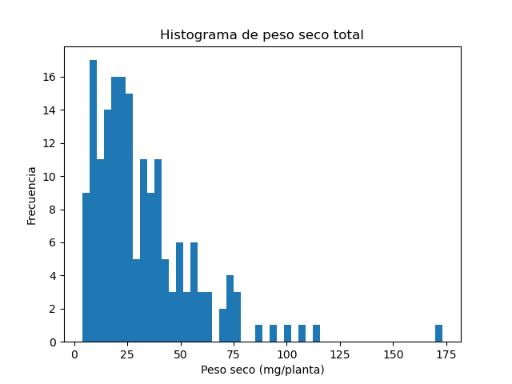

**Trabajo final del curso de Herramientas de Estadistica**
============================================================

***Estudiante: Constanza Rey***

### Marco teórico 
En el marco del presente curso, presento el trabajo practico final donde utilice las herramientas vistas para analizar los datos obtenidos en el marco de mi tesis doctoral. El mismo se centra en el estudio de una especie de rizobio (***Sinorhizobium meliloti***) y su par simbionte (alfalfa, ***Medicago sativa***). Se sabe que todas las cepas de ***S. meliloti*** presentan siempre al menos tres replicones grandes: un cromosoma y dos megaplasmidos tipo pSyms (pSymA y pSymB) y que el pSymA es uno de los mas variables entre cepas. Para poder determinar que genes son los que aportan la diversidad genetica a las cepas de este rizobio, nos propusimos estudiar los pSymAs de varias cepas de ***S. meliloti***. 

### Diseño del experimento
Para evaluar el efecto de los distintos pSymA en el fenotipo, contruimos cepas hibridas de S. meliloti que contienen el mismo contexto genomico y cada uno de los pSymA. Uno de los aspectos a evaluar fue la eficiencia simbiotica de las cepas obtenidas. 
Con ese fin, diseñe un ensayo en alfalfa inoculando con las cepas a evaluar y utilizando 12 plantas por condicion. Luego de un mes y medio, se obtiene la parte aerea de las plantas y cada una se coloca en sobres para dejarlas en estufa a 65°C durante una semana. Finalmente, se registraron los pesos obtenidos en una balanza analitica.
Ademas, dado que en la camara de plantas observamos diferencias al crecer las plantas en un estante u otro, se registraron los estantes en el que colocamos cada una de las plantas. Nos aseguramos de que por estante haya al menos 12 plantas por condicion.

El dataset final consiste en una tabla con las siguientes columnas:
-Estante
-Tratamiento (cepas inoculadas): control, 2011GFP, AK21, AK83, B401, Sma(AK21), Sma(AK83), Sma(B401).
-Peso seco (mg/planta): los pesos secos de cada planta registrados.

***Variables a evaluar***
   * Variable continua: peso seco de las plantas expresado en mg/planta.
   * Variable categorica: estante de la camara donde se colocaron las plantas (Estante1, Estante2).

1) ***DISTRIBUCION Y DESCRIPCION DE LOS DATOS***

Primero, evalue como se distribuyen los datos del peso seco. Para eso, filtre los datos de la columna peso seco y los grafique utilizando la biblioteca mathplotlib.

Los resultados obtenidos se muestran en la siguiente imagen:

Ademas, evalue la **media**de los pesos secos para cada una de las condiciones evaluadas.

>La media del peso seco del control es: Peso seco    7.936364

>La media del peso seco de las muestras inoculadas con 2011GFP es: Peso seco    38.7125

>La media del peso seco de las muestras inoculadas con AK21 es: Peso seco    35.629167

>La media del peso seco de las muestras inoculadas con AK83 es Peso seco    19.354167

>La media del peso seco de las muestras inoculadas con B401 es Peso seco    29.273913

>La media del peso seco de las muestras inoculadas con Sma(AK21) es: Peso seco    35.629167

>La media del peso seco de las muestras inoculadas con Sma(AK83) es: Peso seco    19.354167

>La media del peso seco de las muestras inoculadas con Sma(B401) es: Peso seco    29.273913

2) ***ASIMETRIA Y CURTOSIS***

Luego, analice la asimetria y curtosis de la distribucion de datos. Para eso, calcule el coeficiente de asimetria de Fisher y el coeficiente de curtosis.

>El coeficiente de asimetria de Fisher dio un valor de 2.027382050998325. Esto indica que la distribucion de los datos presenta una **asimetria positiva**.

>El coeficiente de curtosis dio un valor de 7.103412786645373, lo cual indica que la distribución es **leptocurtica**.

PReguntas
!!!!!1

para hacer describe necesito filtrar cada una de las condiciones???

3) ***ESTIMACION DE INTERVALOS DE CONFIANZA***

