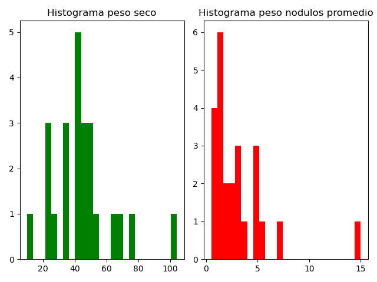

**Trabajo final del curso de Herramientas de Estadistica**
============================================================

***Estudiante: Constanza Rey***

### Marco teórico 
En el marco del presente curso, presento el trabajo practico final donde utilice las herramientas vistas para analizar los datos obtenidos en el marco de mi tesis doctoral. El mismo se centra en el estudio de una especie de rizobio (***Sinorhizobium meliloti***) y su par simbionte (alfalfa, ***Medicago sativa***). Se sabe que todas las cepas de ***S. meliloti*** presentan siempre al menos tres replicones grandes: un cromosoma y dos megaplasmidos tipo pSyms (pSymA y pSymB) y que el pSymA es uno de los mas variables entre cepas. Para poder determinar que genes son los que aportan la diversidad genetica a las cepas de este rizobio, nos propusimos estudiar los pSymAs de varias cepas de ***S. meliloti***. 


### Diseño del experimento
Para evaluar el efecto de los distintos pSymA en el fenotipo, contruimos cepas hibridas de S. meliloti que contienen el mismo contexto genomico y cada uno de los pSymA. Uno de los aspectos a evaluar fue la eficiencia simbiotica de las cepas obtenidas. 
Con ese fin, diseñe un ensayo en alfalfa inoculando con las cepas a evaluar y utilizando 12 plantas por condicion. Luego de un mes y medio, se obtiene la parte aerea de las plantas y cada una se coloca en sobres para dejarlas en estufa a 65°C durante una semana. Finalmente, se registraron los pesos obtenidos en una balanza analitica.
Ademas, dado que en la camara de plantas observamos diferencias al crecer las plantas en un estante u otro, se registraron los estantes en el que colocamos cada una de las plantas. Nos aseguramos de que por estante haya al menos 12 plantas por condicion.


El dataset final consiste en una tabla con las siguientes columnas:
* Estante: Estante1, Estante2.
* Tratamiento (cepas inoculadas): control, 2011GFP, AK21, AK83, B401, Sma(AK21), Sma(AK83), Sma(B401).
* Peso seco (mg/planta): los pesos secos de cada planta registrados.


***Variable a evaluar***
   * Variable continua: peso seco de las plantas expresado en mg/planta.

## 1) ***DISTRIBUCION Y DESCRIPCION DE LOS DATOS***

Primero, evalue como se distribuyen los datos del peso seco. Para eso, filtre los datos de la columna peso seco y los grafique utilizando la biblioteca mathplotlib.

Los resultados obtenidos se muestran en la siguiente imagen:


En el histograma, se observa que los datos no se distribuirian normalmente. Aun asi, realizo mas adelante un contraste de hipotesis para evaluarlo estadisticamente.

En clase, mencionamos dos tipos de parametros que caracterizan a una distribucion: los parametros de *centralizacion* y los parametros de *dispersion*. Dentro de los parametros de centralizacion, se destacan la **media**, la **mediana** y la **moda**, los cuales los calcule en base a los pesos secos para cada una de las condiciones y para el total de datos.
A continuacion se observa un ejemplo con las medias obtenidas:

>La media del peso seco total es: 31.96

>La media del peso seco del control es: Peso seco    7.936364

>La media del peso seco de las muestras inoculadas con 2011GFP es: Peso seco    38.7125

>La media del peso seco de las muestras inoculadas con AK21 es: Peso seco    35.629167

>La media del peso seco de las muestras inoculadas con AK83 es Peso seco    19.354167

>La media del peso seco de las muestras inoculadas con B401 es Peso seco    29.273913

>La media del peso seco de las muestras inoculadas con Sma(AK21) es: Peso seco    35.629167

>La media del peso seco de las muestras inoculadas con Sma(AK83) es: Peso seco    19.354167

>La media del peso seco de las muestras inoculadas con Sma(B401) es: Peso seco    29.273913

Por otro lado, calcule el valor de ciertos parametros de dispersion como el **rango de valores**, **desviacion tipica** y **varianza**. Todos calculados tambien para cada condicion y total.

## 2) ***ASIMETRIA Y CURTOSIS***

Luego, analice la asimetria y curtosis de la distribucion de datos. Para eso, calcule el coeficiente de asimetria de Fisher y el coeficiente de curtosis.

- Coeficiente de asimetria:

```python
skewness = peso_seco.skew(axis=0, skipna=True, numeric_only=False)
```

El coeficiente de asimetria de Fisher dio un valor de 2.027382050998325. Esto indica que la distribucion de los datos presenta una **asimetria positiva**.

- Coeficiente de curtosis:

```python
kurtosis = peso_seco.kurt(axis=0, skipna=True, numeric_only=False)
```

El coeficiente de curtosis dio un valor de 7.103412786645373, lo cual indica que la distribución es **leptocurtica**.


PReguntas
!!!!!1

-porque la varianza me da 570??

## 3) ***ESTIMACION DE INTERVALOS DE CONFIANZA***


## 4) ***ESTIMACION DEL TAMAÑO MUESTRAL***

El tamaño muestral se puede estimar definiendo previamente una serie de parametros:
>alpha = 0.05

>power = 0.8

>tamaño del efecto = int(abs(media_control - media_gfp) / desv_total)

>dos colas

El tamaño del efecto se define como la diferencia entre los valores promedio que espero obtener dividido la desviacion tipica total. En este caso, utilice la diferencia entre la media del peso seco del control y de la muestra inoculada con la cepa 2011 GFP, dado que entre estas dos muestras seguramente haya diferencia (la muestra gfp seria un control positivo).

De esta manera, el script final seria:
```python
n_peso = tt_ind_solve_power(effect_size=effect_size_peso, alpha=alpha, power=power, ratio=1.0, alternative='two-sided')
```

Como resultado, el minimo tamaño muestral que necesito para detectar diferencia entre grupos si es que existe seria 17.


## 5) ***CONTRASTE DE HIPOTESIS***

Primero, realice test de hipotesis para verificar si se cumplen los supuestos de *normalidad* y *homocedasticidad de varianzas*.

a) Para verificar si los datos se distribuyen normalmente, realice un test de normalidad (Normal test), dado que brinda una buena
estimacion cuando se cuenta con menos de 5000 datos.
Se plantearon dos hipotesis:
- H0: los datos se distribuyen normalmente.
- H1: los datos no se distribuyen normalmente.
El script utilizado para realizar el test fue el siguiente:

```python
ss.normaltest(peso_seco, axis=0, nan_policy='propagate')
```

El resultado obtenido fue el siguiente: NormaltestResult(statistic=94.3678816604075, pvalue=3.2231080362482276e-21). El valor de p-value menor a 0.05, permite rechazar la H0 y aceptar la H1, es decir que ***los datos no se distribuyen normalmente**.

b) Para verificar similitud de varianzas, realice un test de Levene. Se plantearon dos hipotesis:
- H0: la homocedasticidad de varianzas en el peso seco de las muestras se debe al azar.
- H1: la homocedasticidad de varianzas en el peso seco de las muestras no se debe al azar.
Para realizar este test, compare los valores de peso seco obtenidos para el control y los obtenidos al inocular las plantas con la cepa 2011 GFP. 

El script utilizado fue:
```python
ss.levene(lista_control, lista_gfp, center='median', proportiontocut=0.05
```

El resultado obtenido fue el siguiente: LeveneResult(statistic=32.61406676437943, pvalue=8.962316508662243e-07). El valor de p-value menor a 0.05, permite rechazar H0 y aceptar H1, es decir que **las varianzas no son similares entre las muestras**. Dado que una de las comparaciones no cumple con la homocedasticidad de varianzas, no se cumple este supuesto.


## Dado que los supuestos no se cumplen, debo realizar un test no parametrico para comparar los grupos.

El objetivo es comparar los valores de peso seco obtenidos de las plantas control y aquellas inoculadas con 7 tipos de rizobios: 2011GFP, AK21, AK83, B401, Sma818R(pSymA AK21), Sma818R(pSymA AK83), Sma818R(pSymA B401). Las ultimas tres cepas mencionadas contienen un genoma compuesto por un cromosoma y pSymB similar y distinto pSymA. 

El test no parametrico utilizado para comparar los 8 grupos fue el test de Kruskal-Wallis, ya que permite comparar mas de 3 grupos.
Las hipotesis planteadas fueron las siguientes:
-H0: las diferencias entre las muestras se deben al azar.
-H1:las diferencias entre las muestras no se deben al azar.

El script utilizado fue:

```python
ss.kruskal(control, gfp, AK21, AK83, B401, SmaAK21, SmaAK83, SmaB401, nan_policy= 'propagate', axis=0, keepdims=False)
```

El resultado obtenido fue:
>KruskalResult(statistic=array([7.58756481e-02, 1.77000000e+02, 7.25729970e+01]), pvalue=array([9.99999112e-01, 8.37571234e-35, 4.45519986e-13]))

Segun el p-value (4e-13) menor a 0.05, rechazo H0 y acepto H1, es decir que existen diferencias significativas entre al menos 2 muestras.


###¿Como comparar grupos entre si para saber cual es el que tiene diferencias (entre pares?)


## Analisis de dependencia de variables categoricas.

Para comparar dos tipos de datos, construi una tabla de contingencia. Los datos a comparar fueron los siguientes:

- Variable 1: peso seco expresado en mg/planta. Fueron convertidos a datos categoricos utilizando un punto de corte (mayor a 15 mg/planta: 'Alto', menor a 15mg/planta: 'Bajo').
- Variable 2: estante donde se ubicaron las plantas. Las opciones posibles son: 'Estante1' o 'Estante2'.

Entonces, para comprobar si existe una relacion entre la variable 1: 'Peso seco' y la variable 2: 'Estante', plantie dos hipotesis:
- H0: las variables son independientes.
- H1: las variables no son independientes, es decir, existe relacion entre las mismas.

Inicialmente como explique previamente, construi un script para convertir los datos numericos de peso seco a datos categoricos y dichos resultados los agregue a una columna extra en el dataframe llamada 'Peso seco categorico'.

Una vez convertidos los datos, arme la tabla de contingencia y agrupe los datos con la operacion 'groupby'.
El script utilizado fue el siguiente:

```python
   df2 = datos_final['Peso seco categorico'] + datos_final['Estante']
   a= datos_final['Peso seco categorico'] == 'Alto'
   b= datos_final['Estante'] == 'Estante1'
   groups = df2.groupby([a,b]).count() 
```


El resultado obtenido fue el siguiente:
```python
Peso seco categorico  Estante
False                 False      21
                      True       23
True                  False      75
                      True       59
```

Finalmente, utilice el test estadistico de chi-cuadrado para determinar asociacion entre las dos variables categoricas partiendo de la tabla de contingencia.

```python
ss.chisquare(groups, ddof=0, axis=0)
```

El resultado obtenido fue: Power_divergenceResult(statistic=102.53932584269663, pvalue=4.420065487234606e-22). El p-value menor a 0.05, indica que rechazo H0 y acepto H1, es decir que **existe relacion entre la variable Estante y la variable Peso seco**.


## Analisis de correlacion entre dos variables.

Para realizar este punto del trabajo, utilice un dataset distinto al anterior. En este caso, la tabla cuenta con dos variables a analizar:

- Peso seco de plantas expresado en mg/planta. Estos resultados fueron obtenidos para plantas inoculadas solo con la cepa 2011GFP.
- Promedio de peso fresco de nodulos por planta.

Inicialmente, realice un histograma para cada tipo de datos para observar como se distribuyen.




